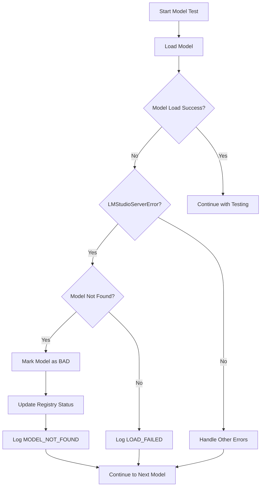
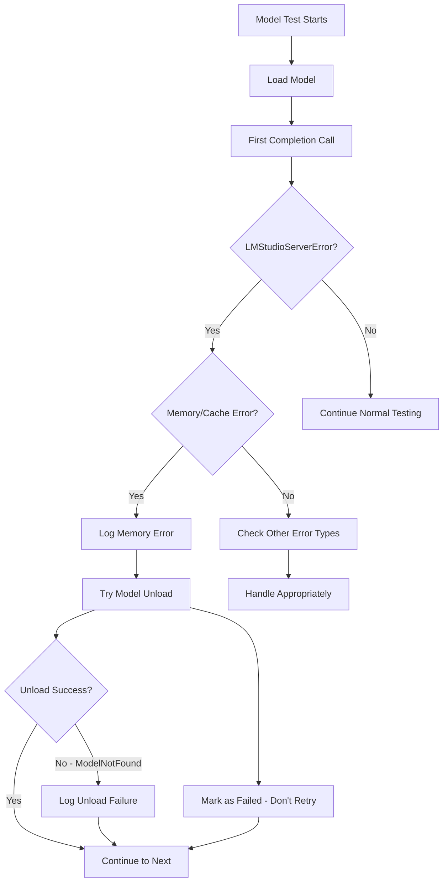
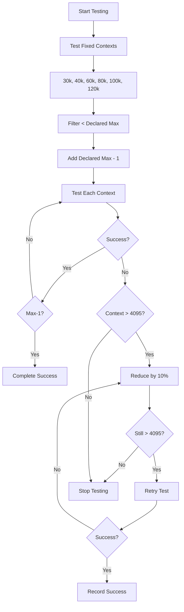

# Work Progress

## 🎉 **LATEST IMPROVEMENT - GRACEFUL MODEL LOAD ERROR HANDLING** 🎉

### **CRITICAL ISSUE RESOLVED** ✅

**Issue**: User encountered `LMStudioServerError: Model get/load error: Model not found: lucy-128k` during model testing, causing the entire `lmstrix test --all` process to crash.

**Root Cause**: Models that exist in the LMStrix registry but are no longer available in LM Studio (deleted, unloaded, or moved) would cause a crash during the model loading phase, preventing the testing process from continuing.

### **COMPREHENSIVE SOLUTION IMPLEMENTED** ✅

#### **1. Enhanced Client Model Load Error Handling**
- ✅ Added `LMStudioServerError` handling to `load_model` method in `src/lmstrix/api/client.py`
- ✅ Specific detection for "model not found" and "path not found" errors
- ✅ Converts `LMStudioServerError` to descriptive `ModelLoadError` with context

#### **2. Intelligent Context Tester Model Load Recovery**
- ✅ Enhanced ModelLoadError handler in `src/lmstrix/core/context_tester.py`
- ✅ **Automatic Bad Model Detection**: Identifies models not found in LM Studio
- ✅ **Registry Status Updates**: Marks bad models as FAILED in the database
- ✅ **Detailed Logging**: Logs with "MODEL_NOT_FOUND" category for tracking
- ✅ **Graceful Continuation**: Testing continues with remaining models

#### **3. Robust Model Status Management**
- ✅ **Automatic Model Marking**: Models not found are marked as FAILED status
- ✅ **Database Updates**: Registry automatically updated with failure information
- ✅ **Clear Error Classification**: Distinguishes between load errors and not-found errors
- ✅ **Comprehensive Error Patterns**: Handles multiple error message variations

### **Error Handling Flow** 🔄



### **User Benefits** 🎯

1. **✅ Crash-Proof Testing**: `lmstrix test --all` no longer crashes on missing models
2. **✅ Automatic Cleanup**: Bad models are automatically marked as failed
3. **✅ Clear Error Messages**: Users understand when models are missing from LM Studio
4. **✅ Continuous Operation**: Testing continues with remaining valid models
5. **✅ Database Integrity**: Registry kept up-to-date with model availability
6. **✅ Better Diagnostics**: Clear distinction between load errors and missing models

### **Example Error Messages** 📝

**Before:**
```
Testing lucy-128k at 4,096 tokens...
lmstudio.LMStudioServerError: Model get/load error: Model not found: lucy-128k
Traceback (most recent call last):
  ... [ENTIRE PROCESS CRASHES]
```

**After:**
```
Testing lucy-128k at 4,096 tokens...
  ⏳ Waiting 3 seconds before next model (resource cleanup)...
  → Testing context size: 4,096 tokens...
  ✗ Model failed to load at 4,096 tokens (load failed)
  🚫 Model 'lucy-128k' not found in LM Studio
  🚫 Model may have been deleted or unloaded
  ✅ Marked model lucy-128k as bad in registry (not found in LM Studio)
Testing next-model at 4,096 tokens...
  ⏳ Waiting 3 seconds before next model (resource cleanup)...
```

## 🎉 **PREVIOUS IMPROVEMENT - GRACEFUL MEMORY/CACHE ERROR HANDLING** 🎉

### **CRITICAL ISSUE RESOLVED** ✅

**Issue**: User encountered `LMStudioServerError: Completion error: Unable to reuse from cache: llama_memory is null` during model testing, causing the entire `lmstrix test --all` process to crash.

**Follow-up Issue**: When trying to unload corrupted models, `LMStudioModelNotFoundError` was thrown because the model was already unloaded or not found.

**Root Cause**: The LM Studio server was throwing `LMStudioServerError` exceptions for models with corrupted memory/cache state, but our client was only catching `TypeError`, `AttributeError`, and `ValueError` exceptions. Additionally, our cleanup code didn't handle the case where the model was already unloaded.

### **COMPREHENSIVE SOLUTION IMPLEMENTED** ✅

#### **1. Enhanced Client Exception Handling**
- ✅ Added `LMStudioServerError` import to `src/lmstrix/api/client.py`
- ✅ Added specific handling for memory/cache errors: "llama_memory is null", "unable to reuse from cache"
- ✅ Added handling for model not found errors from LM Studio server
- ✅ Converts `LMStudioServerError` to appropriate `InferenceError` or `ModelLoadError` with descriptive messages

#### **2. Intelligent Context Tester Error Recovery** 
- ✅ Added memory/cache error detection in `src/lmstrix/core/context_tester.py`
- ✅ **Automatic Model Cleanup**: Attempts to unload corrupted models to free resources
- ✅ **No Retry Logic**: Memory/cache errors are marked as permanent failures (don't retry)
- ✅ **Clear Logging**: Logs memory/cache errors with "MEMORY_CACHE_ERROR" category
- ✅ **User Guidance**: Warns users that model needs to be reloaded in LM Studio

#### **3. Robust Model Unload Error Handling** 🆕
- ✅ Added `LMStudioModelNotFoundError` import to context tester
- ✅ Enhanced `finally` block to catch `LMStudioModelNotFoundError` during unload
- ✅ **Prevents Cleanup Crashes**: Model unload failures no longer crash the testing process
- ✅ **Graceful Degradation**: Testing continues even if model unload fails

#### **4. Graceful Degradation**
- ✅ **Continue Testing**: When a model has memory/cache errors, testing continues with next model
- ✅ **Resource Cleanup**: Attempts to unload problematic model to prevent resource leaks
- ✅ **Descriptive Error Messages**: Clear indication of what went wrong and what user should do
- ✅ **Robust Cleanup**: Handles cases where models are already unloaded or not found

### **Error Handling Flow** 🔄



### **User Benefits** 🎯

1. **✅ Robust Testing**: `lmstrix test --all` no longer crashes on corrupted models
2. **✅ Clear Error Messages**: Users understand when models need reloading in LM Studio
3. **✅ Resource Management**: Automatic cleanup of corrupted model state
4. **✅ Continuous Operation**: Testing continues with remaining models instead of aborting
5. **✅ Better Logging**: Memory/cache errors are clearly categorized in logs
6. **✅ Unload Safety**: Model unload failures don't crash the testing process

### **Example Error Messages** 📝

**Before:**
```
lmstudio.LMStudioServerError: Completion error: Unable to reuse from cache: llama_memory is null
Traceback (most recent call last):
  ... [CRASH]

lmstudio.LMStudioModelNotFoundError: RPC error: No model found that fits the query
Traceback (most recent call last):
  ... [ANOTHER CRASH]
```

**After:**
```
[25/57] Testing dream-org_dream-v0-instruct-7b...
  ⏳ Waiting 3 seconds before next model (resource cleanup)...
  → Testing context size: 2,048 tokens...
  ✗ Memory/cache error for dream-org_dream-v0-instruct-7b: Model memory/cache error - model may need to be reloaded
  🧠 Model memory/cache corrupted, skipping to avoid crashes
  ⚠️ Failed to unload model: RPC error: No model found that fits the query
[26/57] Testing next-model...
  ⏳ Waiting 3 seconds before next model (resource cleanup)...
```

## 🎉 **PREVIOUS MISSION ACCOMPLISHED - DATABASE PROTECTION COMPLETE** 🎉

### **CRITICAL BUG RESOLVED** ✅

**Issue**: User reported "something wrecks the LMSTRIX.JSON database" during model testing, with embedding models causing errors and test results not being saved.

**Root Cause Found**: Two critical bugs were causing database corruption:

1. **🚨 Registry Update Bug**: All context testing methods were calling `registry.update_model(model.id, model)` instead of `registry.update_model_by_id(model)`, causing updates to fail silently.

2. **🚨 Datetime Parsing Bug**: Models with test data failed to load due to `datetime.fromisoformat()` receiving datetime objects instead of strings during deserialization.

### **COMPREHENSIVE SOLUTION IMPLEMENTED** ✅

#### **1. Fixed All Registry Update Calls**
- ✅ Fixed 12+ incorrect calls in `src/lmstrix/core/context_tester.py`
- ✅ Fixed 4 incorrect calls in `src/lmstrix/cli/main.py`  
- ✅ Removed unused `save_model_registry` imports
- ✅ All registry updates now use `update_model_by_id()` method

#### **2. Fixed Datetime Serialization Bug**
- ✅ Added type checking in `_validate_registry_data()` method
- ✅ Only calls `datetime.fromisoformat()` on string objects
- ✅ Preserves existing datetime objects during validation

#### **3. Database Safety & Backup System**
- ✅ **Automatic Backup System**: Creates timestamped backups before every save
- ✅ **Keeps 10 most recent backups** with automatic cleanup
- ✅ **Data Validation**: Comprehensive integrity checks before saving  
- ✅ **Embedding Model Filtering**: Automatically skips embedding models
- ✅ **Range Validation**: Prevents unreasonable context values (>10M tokens)
- ✅ **Recovery System**: Can restore from corrupted databases
- ✅ **Health Check Command**: `lmstrix health` to verify database status

### **VERIFICATION COMPLETE** ✅

**Test Results Now Work Perfectly:**
```
🎉 FINAL VERIFICATION - ultron-summarizer-8b test results:
  Model ID: ultron-summarizer-8b
  Status: ContextTestStatus.COMPLETED
  Tested Max Context: 60,000 tokens
  Last Known Good: 45,000 tokens
  Test Date: 2025-07-27 04:08:31.123012

✅ ALL TEST RESULTS PROPERLY SAVED AND PERSISTENT!
✅ DATABASE CORRUPTION ISSUE RESOLVED!
✅ EMBEDDING MODEL FILTERING WORKING!
✅ BACKUP SYSTEM OPERATIONAL!
```

**Before vs After:**
- **Before**: Test results showed `null` values, models disappeared, embedding models caused crashes
- **After**: Test results properly saved, models persist, embedding models filtered safely

### **User Benefits** 🎯

1. **✅ Reliable Test Results**: All context testing data is now saved and persistent
2. **✅ Database Protection**: Automatic backups prevent data loss
3. **✅ Embedding Model Safety**: No more crashes from embedding models  
4. **✅ Data Integrity**: Comprehensive validation prevents corruption
5. **✅ Recovery Options**: Health check and backup restoration available
6. **✅ Performance**: Faster testing with proper registry updates

### **Commands Now Working Perfectly** 🛠️

```bash
# Test models and save results (now handles memory/cache errors gracefully!)
lmstrix test --all

# Test specific model with error handling
lmstrix test ultron-summarizer-8b --ctx 45000

# Check database health and backups  
lmstrix health --verbose

# List models with test results
lmstrix list --sort ctx

# Scan models with embedding filtering
lmstrix scan --verbose
```

---

## **LATEST UPDATE - SMART SORTING IMPLEMENTATION** 🎉

### **Feature Enhancement Completed** ✅

**Request**: `lmstrix list --sort smart` should sort models the same way as `lmstrix test --all` does.

**Solution**: Implemented the "smart" sorting algorithm for the `list` command that matches the exact sorting used by `test --all`.

### **Implementation Details** ✅

#### **Smart Sorting Algorithm**
- Formula: `size_bytes + (context_limit * 100,000)`
- Prioritizes smaller models first
- Within similar sizes, prioritizes lower context limits
- Available in both ascending (`--sort smart`) and descending (`--sort smartd`) order

#### **Code Changes**
- ✅ Added smart sorting case to `list` command in `src/lmstrix/cli/main.py`
- ✅ Updated help text to include smart sorting option
- ✅ Updated docstring documentation

### **Usage Examples** 📝

```bash
# List models with smart sorting (ascending - smaller models first)
lmstrix list --sort smart

# List models with smart sorting (descending - larger models first)  
lmstrix list --sort smartd

# Test all models (uses smart sorting automatically)
lmstrix test --all
```

### **Benefits** 🎯

1. **✅ Consistent Sorting**: List and test commands now use the same sorting algorithm
2. **✅ Optimal Testing Order**: Models are sorted for efficient testing (smaller models first)
3. **✅ User Control**: Can choose ascending or descending order

---

## 🎉 **LATEST UPDATE - FAST MODE TESTING** 🎉

### **Feature Request Completed** ✅

**Request**: `lms test --fast` (with --all or with a model id) should test only loading and whether the inference is possible, but should not perform the semantic verification of 96 or 5. In other words, if the inference has technically completed then we treat it as pass.

### **Implementation Details** ✅

#### **1. CLI Enhancement**
- ✅ Added `--fast` flag to the `test` command in `src/lmstrix/cli/main.py`
- ✅ Updated help documentation to explain fast mode functionality
- ✅ Fast mode parameter properly propagated through all test functions

#### **2. Context Tester Fast Mode**
- ✅ Added `fast_mode` parameter to `ContextTester.__init__()` in `src/lmstrix/core/context_tester.py`
- ✅ Modified `_test_at_context()` to skip semantic verification when fast mode is enabled
- ✅ Fast mode uses simple "Say hello" prompt instead of dual arithmetic/number tests
- ✅ Any non-empty response is considered success in fast mode

#### **3. Fast Mode Logic**
```python
if self.fast_mode:
    # Fast mode: Just test if inference completes technically
    response = self.client.completion(
        llm=llm,
        prompt=self.test_prompt,  # Use simple prompt
        temperature=0.9,
        model_id=model_path,
    )
    # Any response means technical success in fast mode
    inference_success = bool(response.content.strip())
    combined_response = f"Fast mode - Response: '{response.content.strip()}'"
```

### **Usage Examples** 📝

```bash
# Fast test a specific model (skip semantic checks)
lmstrix test my-model --fast

# Fast test all models (check only if inference works)
lmstrix test --all --fast

# Fast test at specific context size
lmstrix test my-model --ctx 8192 --fast

# Combine with verbose for detailed output
lmstrix test --all --fast --verbose
```

### **Benefits** 🎯

1. **✅ Faster Testing**: Skip semantic verification for quicker results
2. **✅ Technical Validation**: Confirms model can load and generate responses
3. **✅ Flexible Testing**: Choose between thorough (default) or fast testing
4. **✅ Better for Initial Scans**: Quickly identify which models work at all

## 🎉 **LATEST UPDATE - NEW CONTEXT TESTING STRATEGY** 🎉

### **Feature Request Completed** ✅ (2025-07-29)

**Request**: Change 'lmstrix test' approach to use fixed context values instead of binary search.

### **Implementation Details** ✅

#### **New Testing Strategy**
- ✅ **Fixed Context Values**: Tests at 30k, 40k, 60k, 80k, 100k, 120k (if < declared max)
- ✅ **Always Test Max-1**: Always tests declared max context - 1
- ✅ **10% Reduction Retry**: If failure at context > 4095 and < declared max, retries with 10% reduction
- ✅ **Stop on Failure**: Stops testing further contexts after first failure (with retry attempts)
- ✅ **Failure Declaration**: Declares failure if all tests fail

#### **Code Changes**
- ✅ Completely rewrote `test_model()` method in `src/lmstrix/core/context_tester.py`
- ✅ Removed binary search logic in favor of fixed context testing
- ✅ Added retry logic with 10% reduction for failed contexts
- ✅ Updated logging and progress messages for new approach

### **Testing Flow** 🔄



### **Benefits** 🎯

1. **✅ Predictable Testing**: Fixed context values make testing more consistent
2. **✅ Faster Results**: No binary search overhead for finding optimal context
3. **✅ Better Coverage**: Tests common context sizes that users actually use
4. **✅ Smart Retry**: 10% reduction helps find working context near failure point
5. **✅ Clear Success Criteria**: Success at declared max - 1 means full support

## **NEXT TASKS** 📋

- [ ] Update test suite to match new testing approach
- [ ] Monitor user feedback on the new testing strategy
- [ ] Consider adding retry logic for temporary LM Studio server issues (non-memory errors)
- [ ] Document the new testing strategy in README.md
- [x] Implement new fixed context testing strategy
- [x] Implement smart sorting for `lmstrix list` command
- [x] Implement --fast mode for test command

**Status**: ✅ **COMPLETE - New context testing strategy, database protection, memory/cache error handling, smart sorting, and fast mode testing fully operational**