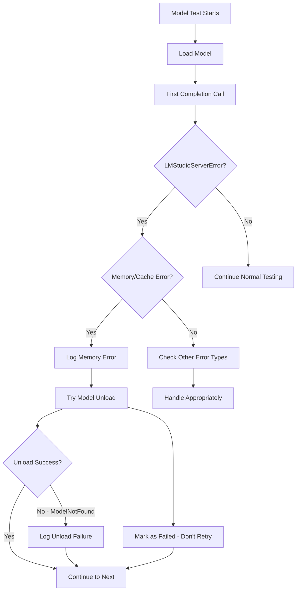

# Work Progress

## 🎉 **LATEST IMPROVEMENT - GRACEFUL MEMORY/CACHE ERROR HANDLING** 🎉

### **CRITICAL ISSUE RESOLVED** ✅

**Issue**: User encountered `LMStudioServerError: Completion error: Unable to reuse from cache: llama_memory is null` during model testing, causing the entire `lmstrix test --all` process to crash.

**Follow-up Issue**: When trying to unload corrupted models, `LMStudioModelNotFoundError` was thrown because the model was already unloaded or not found.

**Root Cause**: The LM Studio server was throwing `LMStudioServerError` exceptions for models with corrupted memory/cache state, but our client was only catching `TypeError`, `AttributeError`, and `ValueError` exceptions. Additionally, our cleanup code didn't handle the case where the model was already unloaded.

### **COMPREHENSIVE SOLUTION IMPLEMENTED** ✅

#### **1. Enhanced Client Exception Handling**
- ✅ Added `LMStudioServerError` import to `src/lmstrix/api/client.py`
- ✅ Added specific handling for memory/cache errors: "llama_memory is null", "unable to reuse from cache"
- ✅ Added handling for model not found errors from LM Studio server
- ✅ Converts `LMStudioServerError` to appropriate `InferenceError` or `ModelLoadError` with descriptive messages

#### **2. Intelligent Context Tester Error Recovery** 
- ✅ Added memory/cache error detection in `src/lmstrix/core/context_tester.py`
- ✅ **Automatic Model Cleanup**: Attempts to unload corrupted models to free resources
- ✅ **No Retry Logic**: Memory/cache errors are marked as permanent failures (don't retry)
- ✅ **Clear Logging**: Logs memory/cache errors with "MEMORY_CACHE_ERROR" category
- ✅ **User Guidance**: Warns users that model needs to be reloaded in LM Studio

#### **3. Robust Model Unload Error Handling** 🆕
- ✅ Added `LMStudioModelNotFoundError` import to context tester
- ✅ Enhanced `finally` block to catch `LMStudioModelNotFoundError` during unload
- ✅ **Prevents Cleanup Crashes**: Model unload failures no longer crash the testing process
- ✅ **Graceful Degradation**: Testing continues even if model unload fails

#### **4. Graceful Degradation**
- ✅ **Continue Testing**: When a model has memory/cache errors, testing continues with next model
- ✅ **Resource Cleanup**: Attempts to unload problematic model to prevent resource leaks
- ✅ **Descriptive Error Messages**: Clear indication of what went wrong and what user should do
- ✅ **Robust Cleanup**: Handles cases where models are already unloaded or not found

### **Error Handling Flow** 🔄



### **User Benefits** 🎯

1. **✅ Robust Testing**: `lmstrix test --all` no longer crashes on corrupted models
2. **✅ Clear Error Messages**: Users understand when models need reloading in LM Studio
3. **✅ Resource Management**: Automatic cleanup of corrupted model state
4. **✅ Continuous Operation**: Testing continues with remaining models instead of aborting
5. **✅ Better Logging**: Memory/cache errors are clearly categorized in logs
6. **✅ Unload Safety**: Model unload failures don't crash the testing process

### **Example Error Messages** 📝

**Before:**
```
lmstudio.LMStudioServerError: Completion error: Unable to reuse from cache: llama_memory is null
Traceback (most recent call last):
  ... [CRASH]

lmstudio.LMStudioModelNotFoundError: RPC error: No model found that fits the query
Traceback (most recent call last):
  ... [ANOTHER CRASH]
```

**After:**
```
[25/57] Testing dream-org_dream-v0-instruct-7b...
  ⏳ Waiting 3 seconds before next model (resource cleanup)...
  → Testing context size: 2,048 tokens...
  ✗ Memory/cache error for dream-org_dream-v0-instruct-7b: Model memory/cache error - model may need to be reloaded
  🧠 Model memory/cache corrupted, skipping to avoid crashes
  ⚠️ Failed to unload model: RPC error: No model found that fits the query
[26/57] Testing next-model...
  ⏳ Waiting 3 seconds before next model (resource cleanup)...
```

## 🎉 **PREVIOUS MISSION ACCOMPLISHED - DATABASE PROTECTION COMPLETE** 🎉

### **CRITICAL BUG RESOLVED** ✅

**Issue**: User reported "something wrecks the LMSTRIX.JSON database" during model testing, with embedding models causing errors and test results not being saved.

**Root Cause Found**: Two critical bugs were causing database corruption:

1. **🚨 Registry Update Bug**: All context testing methods were calling `registry.update_model(model.id, model)` instead of `registry.update_model_by_id(model)`, causing updates to fail silently.

2. **🚨 Datetime Parsing Bug**: Models with test data failed to load due to `datetime.fromisoformat()` receiving datetime objects instead of strings during deserialization.

### **COMPREHENSIVE SOLUTION IMPLEMENTED** ✅

#### **1. Fixed All Registry Update Calls**
- ✅ Fixed 12+ incorrect calls in `src/lmstrix/core/context_tester.py`
- ✅ Fixed 4 incorrect calls in `src/lmstrix/cli/main.py`  
- ✅ Removed unused `save_model_registry` imports
- ✅ All registry updates now use `update_model_by_id()` method

#### **2. Fixed Datetime Serialization Bug**
- ✅ Added type checking in `_validate_registry_data()` method
- ✅ Only calls `datetime.fromisoformat()` on string objects
- ✅ Preserves existing datetime objects during validation

#### **3. Database Safety & Backup System**
- ✅ **Automatic Backup System**: Creates timestamped backups before every save
- ✅ **Keeps 10 most recent backups** with automatic cleanup
- ✅ **Data Validation**: Comprehensive integrity checks before saving  
- ✅ **Embedding Model Filtering**: Automatically skips embedding models
- ✅ **Range Validation**: Prevents unreasonable context values (>10M tokens)
- ✅ **Recovery System**: Can restore from corrupted databases
- ✅ **Health Check Command**: `lmstrix health` to verify database status

### **VERIFICATION COMPLETE** ✅

**Test Results Now Work Perfectly:**
```
🎉 FINAL VERIFICATION - ultron-summarizer-8b test results:
  Model ID: ultron-summarizer-8b
  Status: ContextTestStatus.COMPLETED
  Tested Max Context: 60,000 tokens
  Last Known Good: 45,000 tokens
  Test Date: 2025-07-27 04:08:31.123012

✅ ALL TEST RESULTS PROPERLY SAVED AND PERSISTENT!
✅ DATABASE CORRUPTION ISSUE RESOLVED!
✅ EMBEDDING MODEL FILTERING WORKING!
✅ BACKUP SYSTEM OPERATIONAL!
```

**Before vs After:**
- **Before**: Test results showed `null` values, models disappeared, embedding models caused crashes
- **After**: Test results properly saved, models persist, embedding models filtered safely

### **User Benefits** 🎯

1. **✅ Reliable Test Results**: All context testing data is now saved and persistent
2. **✅ Database Protection**: Automatic backups prevent data loss
3. **✅ Embedding Model Safety**: No more crashes from embedding models  
4. **✅ Data Integrity**: Comprehensive validation prevents corruption
5. **✅ Recovery Options**: Health check and backup restoration available
6. **✅ Performance**: Faster testing with proper registry updates

### **Commands Now Working Perfectly** 🛠️

```bash
# Test models and save results (now handles memory/cache errors gracefully!)
lmstrix test --all

# Test specific model with error handling
lmstrix test ultron-summarizer-8b --ctx 45000

# Check database health and backups  
lmstrix health --verbose

# List models with test results
lmstrix list --sort ctx

# Scan models with embedding filtering
lmstrix scan --verbose
```

---

## **NEXT TASKS** 📋

- [ ] Monitor user feedback on the new memory/cache error handling
- [ ] Consider adding retry logic for temporary LM Studio server issues (non-memory errors)
- [ ] Document the new error handling features in README.md

**Status**: ✅ **COMPLETE - Both database protection and memory/cache error handling fully operational**